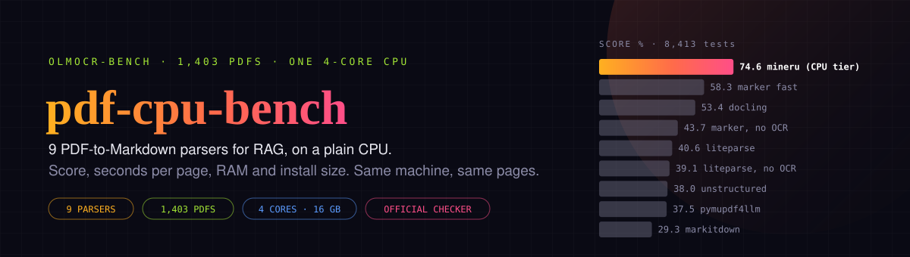
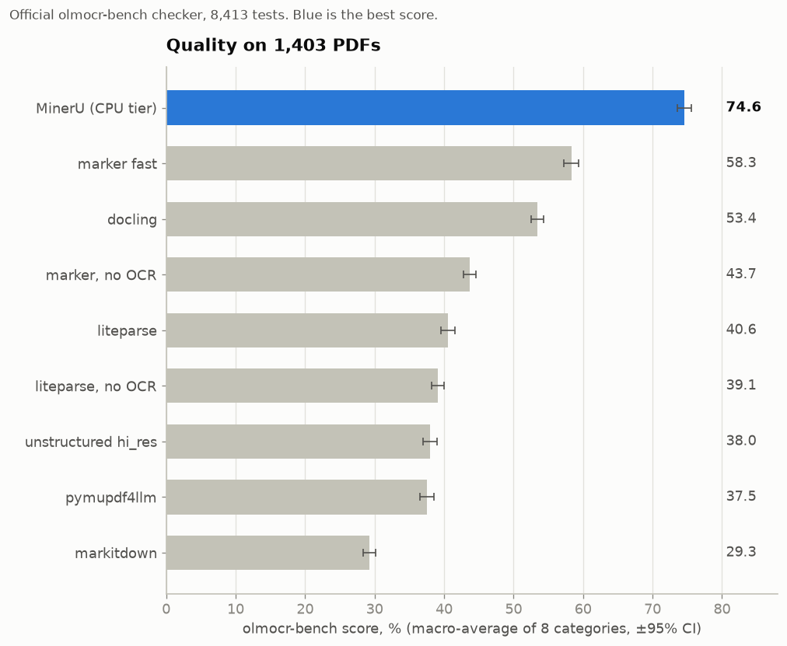
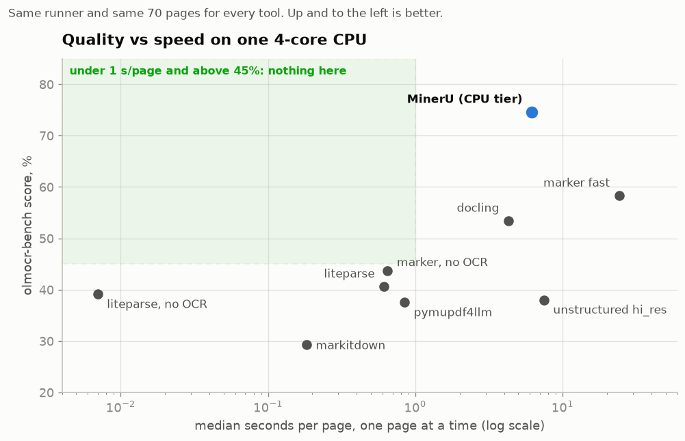
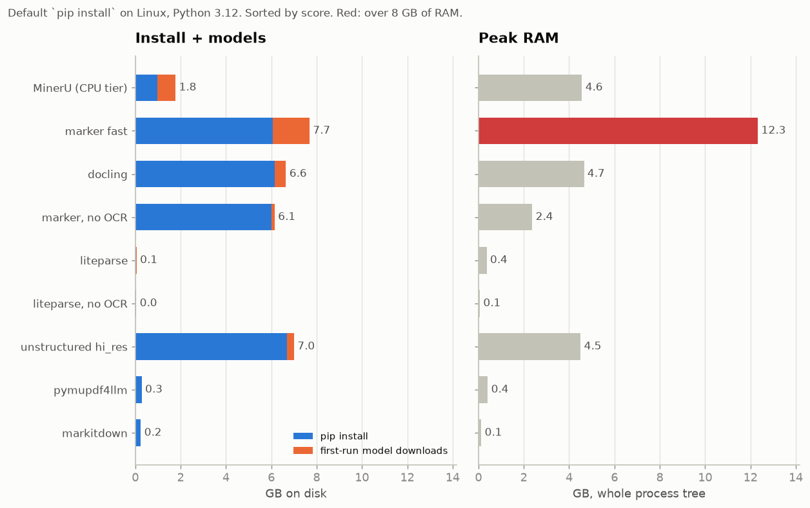
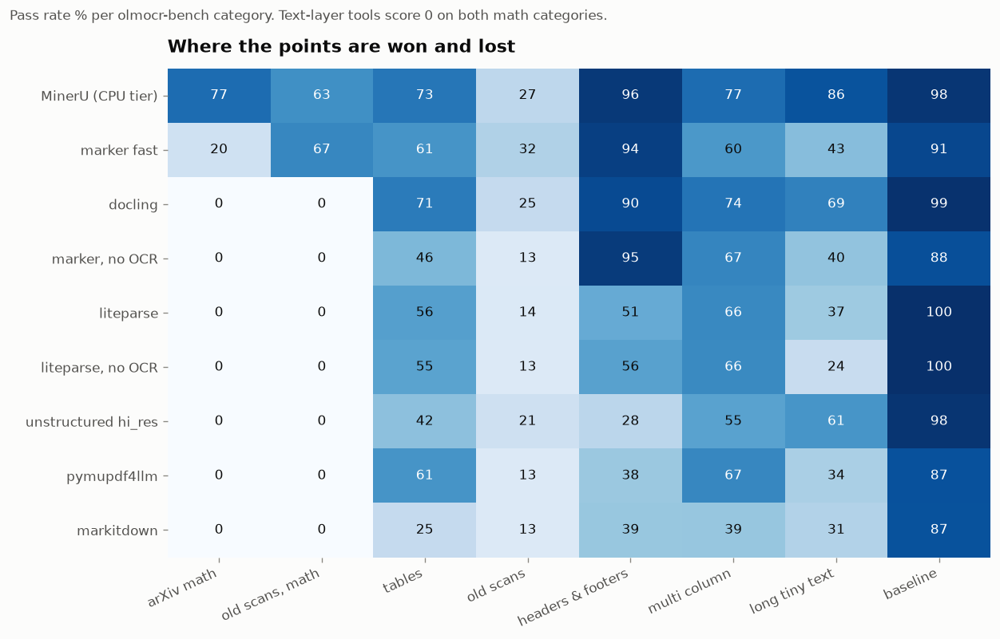
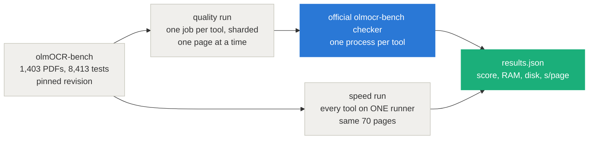

<div align="center">



# pdf-cpu-bench — PDF-to-Markdown parsers for RAG, measured on a plain CPU

**On one 4-core machine with no GPU, MinerU's free CPU tier scored 74.6% on olmocr-bench: 16 points above marker's fast mode and 21 above docling, with a quarter of their disk footprint.**

[](bench/candidates.json)
[](https://huggingface.co/datasets/allenai/olmOCR-bench)
[](https://github.com/allenai/olmocr/tree/main/olmocr/bench)
[](#how-it-was-measured)

[Results](#results) · [Charts](#charts) · [How it was measured](#how-it-was-measured) · [Caveats](#caveats) · [Reproduce](#reproduce)

</div>

---

## Results

Quality on all 1,403 PDFs (8,413 tests, the official olmocr-bench checker). Speed, RAM and disk on **one** GitHub `ubuntu-24.04` runner (AMD EPYC 7763, 4 vCPU, 15.6 GB), the same 70 pages for every tool, one page at a time.

| Parser (default settings) | Version | Score | Seconds / page | Peak RAM | Install + models | License |
|---|---|---:|---:|---:|---:|---|
| **MinerU**, `tier="basic"` (ONNX, CPU) | 4.0.10 | **74.6&nbsp;±&nbsp;1.0** | 6.2 | 4.6&nbsp;GB | 1.8&nbsp;GB | Apache-2.0 + [terms](https://github.com/opendatalab/MinerU/blob/master/LICENSE.md)¹ |
| marker, `fast` | 2.0.0 | 58.3&nbsp;±&nbsp;1.1 | 24.2 | **12.3&nbsp;GB** | 7.7&nbsp;GB | Apache-2.0, weights² |
| docling | 2.134.0 | 53.4&nbsp;±&nbsp;0.9 | 4.3 | 4.7&nbsp;GB | 6.6&nbsp;GB | MIT |
| marker, `fast` + `disable_ocr` | 2.0.0 | 43.7&nbsp;±&nbsp;0.9 | 0.65 | 2.4&nbsp;GB | 6.1&nbsp;GB | Apache-2.0, weights² |
| liteparse | 2.15.1 | 40.6&nbsp;±&nbsp;1.0 | 0.61 | 0.36&nbsp;GB | 0.06&nbsp;GB | Apache-2.0 |
| liteparse, `ocr_enabled=False` | 2.15.1 | 39.1&nbsp;±&nbsp;0.9 | 0.007 | 0.06&nbsp;GB | 0.05&nbsp;GB | Apache-2.0 |
| unstructured, `hi_res` | 0.27.16 | 38.0&nbsp;±&nbsp;1.0 | 7.5 | 4.5&nbsp;GB | 7.0&nbsp;GB | Apache-2.0 |
| pymupdf4llm | 1.28.2 | 37.5&nbsp;±&nbsp;1.0 | 0.85 | 0.41&nbsp;GB | 0.29&nbsp;GB | AGPL-3.0 |
| markitdown `[pdf]` | 0.1.8 | 29.3&nbsp;±&nbsp;0.9 | 0.18 | 0.13&nbsp;GB | 0.25&nbsp;GB | MIT |

<sub>¹ Free commercial use below 100M monthly users or USD 20M monthly revenue; online services must say they use MinerU. ² Model weights under a modified OpenRAIL-M: free for research, personal use and organisations under USD 5M funding/revenue. Score = macro-average of the 8 categories, ±95% CI from the checker's bootstrap. GB = 1024³ bytes. Raw numbers: [`results/results.json`](results/results.json), per-tool checker output: [`results/scores/`](results/scores).</sub>

**What stands out**

- **MinerU's CPU tier is the best option on a CPU by a wide margin.** For scale, marker's README reports 76.0 for its GPU `balanced` mode on the same benchmark. MinerU's CPU tier costs 6 s/page and 4.6 GB of RAM.
- **marker's `fast` mode is not practical without a GPU.** On CPU its VLM runs through llama.cpp: 24 s/page median, 12.3 GB of RAM, and 130 of 1,403 pages (9%) hit the 5-minute timeout (scored as failures).
- **Every tool that only reads the PDF text layer lands between 29% and 44%.** Two of the eight categories are math, and a text layer has no LaTeX, so they score 0 there: a quarter of the average is out of reach before anything else.
- **Default installs are heavy.** docling, marker and unstructured each put 6–7 GB on disk: on Linux their default install pulls PyTorch and its NVIDIA CUDA packages even when you only use the CPU. MinerU's basic tier runs on ONNX and installs no PyTorch at all.
- **No tool is both fast and good.** Nothing scores above 45% at under a second per page ([chart 2](#charts)).

## Charts









## How it was measured



- **Same input for everyone.** Each page goes to each tool as a single-page PDF, through the tool's documented Python API with default settings ([`bench/tools.py`](bench/tools.py)). A failed or timed-out page is written as an empty file, so it scores as a failure rather than being skipped.
- **Quality** comes from the sharded run. GitHub hands out different CPU models per job, which does not change a score but does change timings, so no speed number comes from it.
- **Speed, RAM and disk** come from one job that installs each tool in a fresh venv on the same machine, does a warm-up pass (model downloads land there, not in the timing), times 10 PDFs per category, and deletes the tool before the next ([`bench/speed.sh`](bench/speed.sh)). RAM is sampled across the whole process tree, so inference servers and worker pools count.
- **Disk** = the venv after `pip install` (default extras, Linux, Python 3.12) plus everything written to the model caches on first use.

## Caveats

- Speed is single-stream on 70 pages. Tools that batch or run concurrent workers (marker, MinerU's server mode) can go faster on the same CPU; this is the one-document-at-a-time number.
- marker `fast` on CPU needs a `llama-server` binary that `pip` does not install. It uses a pinned upstream llama.cpp build ([`bench/install-llamacpp.sh`](bench/install-llamacpp.sh)), counted in its disk size.
- unstructured returns elements, not Markdown. They are joined with titles as `#` headings and tables as their HTML; a different rendering could score differently.
- Each tool's published numbers come from other setups. marker's README reports 43.6 for `fast` without OCR, and this run measured 43.7. The same README lists liteparse at 22.4 with its configuration not stated; here, with `output_format="markdown"`, it scored 40.6.
- The GPU modes (marker `balanced`, MinerU `standard`/`advanced`, docling's VLM pipelines) are out of scope: this is about the machine most people run a RAG ingest on.

## Reproduce

Everything runs on GitHub Actions, free on a public repo:

```bash
gh workflow run bench.yml -f limit=0      # full run: ~3 h, mostly marker fast
gh workflow run bench.yml -f limit=5      # smoke run: 5 PDFs per category
gh workflow run rescore.yml -f run_id=<bench run id>   # re-score saved outputs only
```

Candidates and pinned versions live in [`bench/candidates.json`](bench/candidates.json). Charts and header regenerate from `results/results.json` with `python docs/make_charts.py` and `python docs/make_header.py`.

Code in this repo is [MIT](LICENSE). The benchmark PDFs and tests are not redistributed here: they are Ai2's [olmOCR-bench](https://huggingface.co/datasets/allenai/olmOCR-bench) (ODC-BY-1.0), downloaded at a pinned revision when the workflow runs.

Results here come from bench run [37594785474](https://github.com/intikhab49/pdf-cpu-bench/actions/runs/37594785474) and rescore runs [37643034123](https://github.com/intikhab49/pdf-cpu-bench/actions/runs/37643034123) / [37649802042](https://github.com/intikhab49/pdf-cpu-bench/actions/runs/37649802042).
